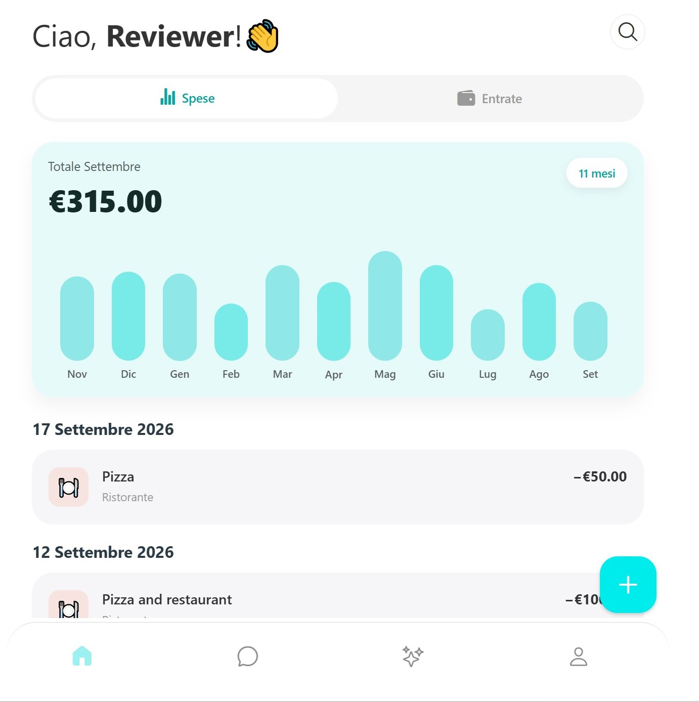
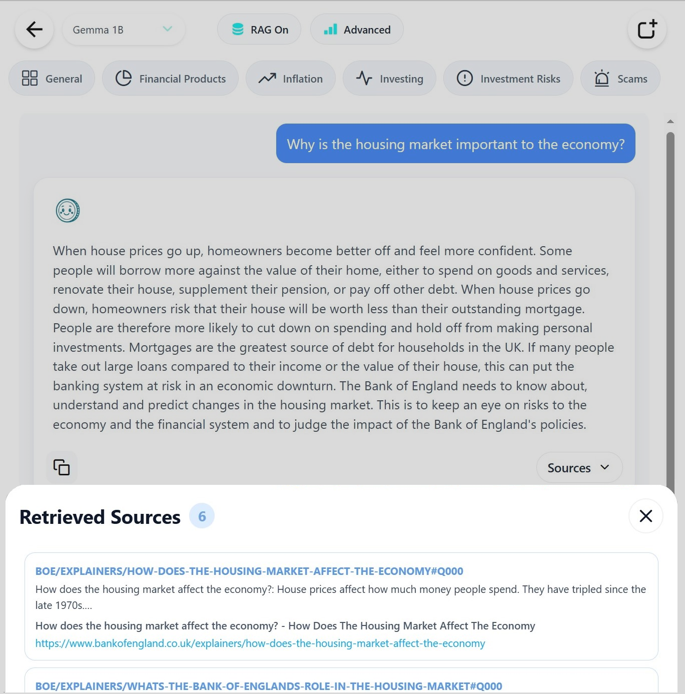
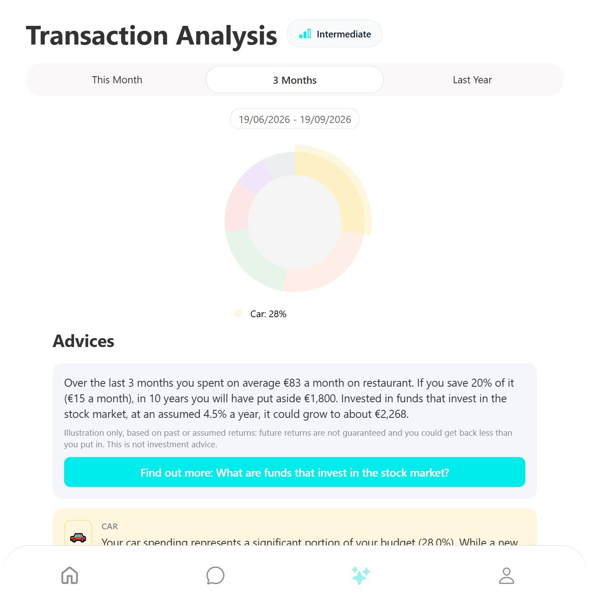
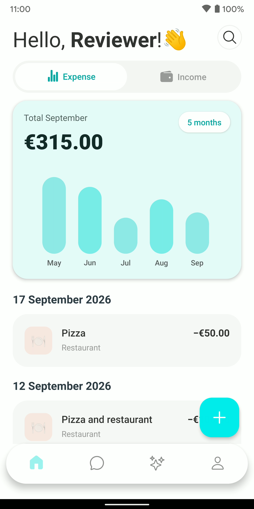
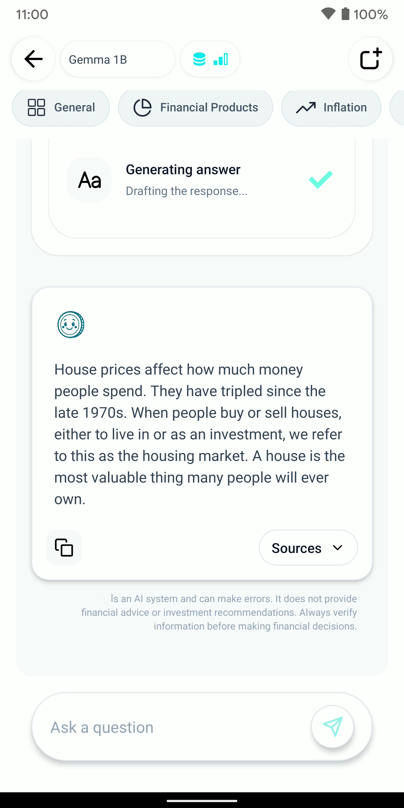
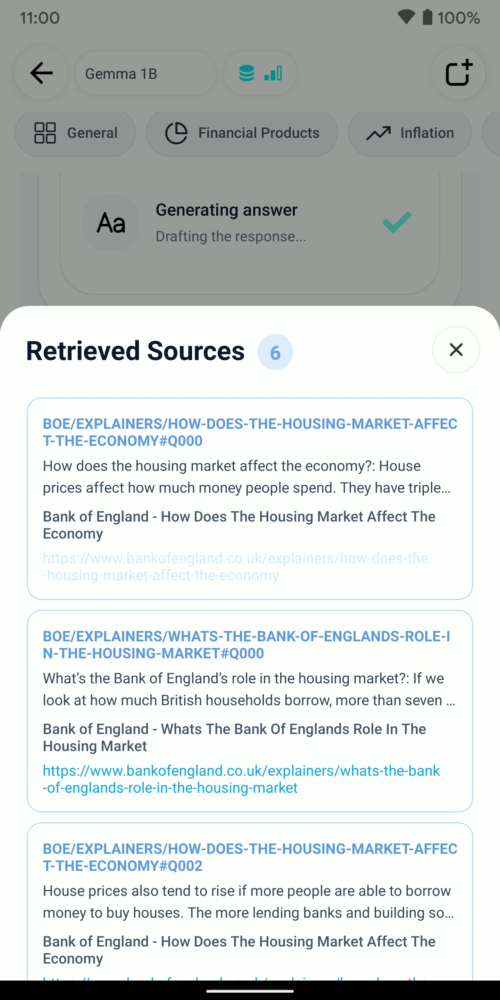
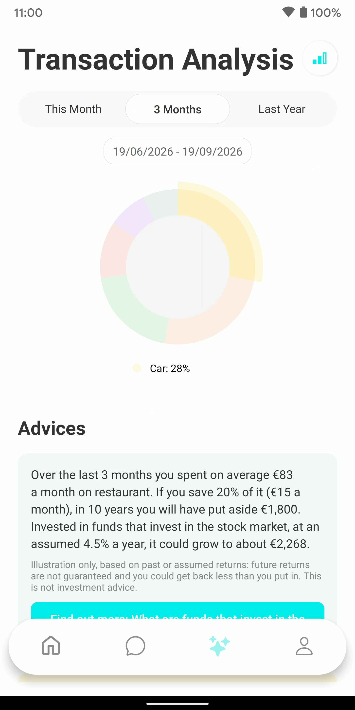
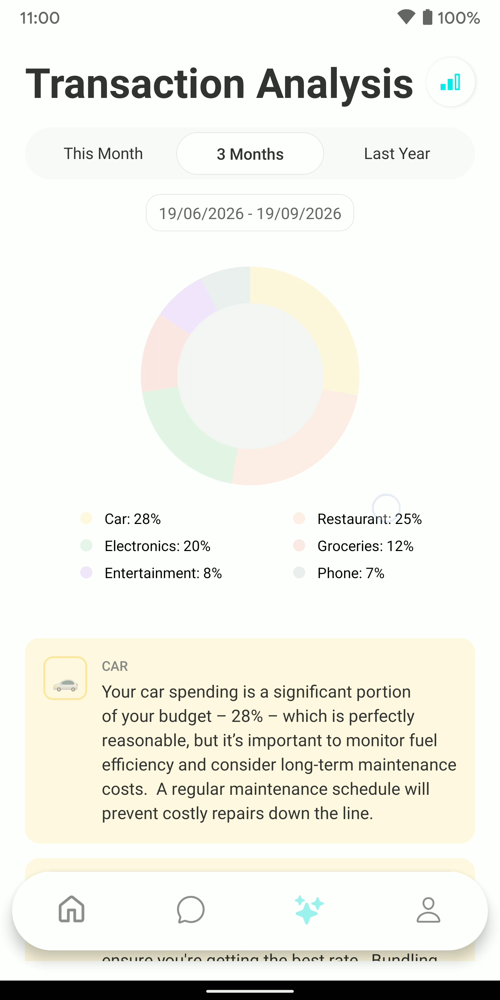

  

## FinGuide - Personal Finance Chatbot for Italian Language

A cross-platform personal finance assistant combining on-device Small Language Models (SLMs), Retrieval-Augmented Generation (RAG), and personalized financial analytics. FinGuide supports users in understanding personal finance concepts through natural language interaction, personalized financial profiling, transaction tracking, and spending analysis.

## 🎥 Demo Video

[Watch the app demo video to discover all features in action!](https://drive.google.com/file/d/1Te2zt-SFq9iBsQyTJrhJFSnyTmTjpCZy/view?usp=sharing)

## 🌐 Live Application

[Try FinGuide live!](https://finguide-web.expo.app/)

A pre-populated reviewer account is available. On the login page, use the dedicated button or sign in with email using the following credentials:

- **Email**: reviewer@reviewer.com
- **Password**: 123456

## 📸 App Screenshots

### Web
 
<br>
 

### Mobile
  
<br>
    


## ✨ Features

### 🤖 RAG-Powered AI Assistant

- **Grounded Responses**: Retrieves relevant passages from authoritative regulator corpora before generating each answer, reducing hallucinations (CONSOB for Italian; FCA and the Bank of England for English)
- **Citation Panel**: Displays regulator source URLs alongside every response for transparency and verifiability (CONSOB / FCA / Bank of England, depending on the session language)
- **Literacy-Aware Guidance**: Adapts vocabulary, explanation depth, and technical terminology to the user's financial knowledge level (Base / Intermediate / Advanced)

### 📋 Financial Literacy Onboarding

- 13-question financial literacy questionnaire on first launch
- Estimated knowledge profile stored and used to personalize all subsequent interactions

### 💳 Transaction Management
- Record income and expenses across multiple months
- Transactions stored locally on mobile (SQLite) and optionally synchronized to Supabase when connectivity is available
- Organized into predefined spending categories

### 📊 Spending Analysis
- Aggregate expenses by category over this month, last 3 months, or last year
- On-device SLM generates personalized spending insights and insights on spending beahviour

### 🔍 Offline Functionality (on mobile application)

- Full on-device SLM inference - financial queries never leave the user's device
- Automatic fallback to local SQLite cache when offline
- Automatic synchronization when connectivity is restored
- All SLM inference runs entirely on-device
- Supabase manages only structured application data (credentials, transactions, profile)
- Financial queries and responses are never transmitted to third-party providers

### 📱 Cross-Platform
- **iOS** & **Android**: Mobile application developen in React-Native
- **Web**: Responsive web version for desktop browsers

## 🧠 System Architecture
FinGuide consists of three main components:
**1. Domain-Specific Datasets** - Two curated question–answer datasets built from authoritative regulator materials. The Italian dataset contains 1,740 pairs derived from CONSOB's "Investor Education" materials (train 1,310 / validation 256 / test 174). The English dataset contains 1,594 pairs derived from the FCA's consumer and InvestSmart guidance and the Bank of England's explainers (train 1,135 / validation 230 / test 155). Both cover financial planning, investments, risk management, investor protection, and more. Each answer is written at three levels of reader expertise (basic, intermediate, advanced).

**2. Fine-Tuned Small Language Models** - Three compact open-weight models (Gemma 3 270M, Gemma 3 1B, SmolLM3 3B) adapted to the financial domain via LoRA, one adapter per language.

**3. Cross-Platform Application** - A sequential pipeline connecting user onboarding → conversational RAG assistance → financial tracking and analysis.

The RAG pipeline performs retrieval with BM25 over the language-specific corpus (CONSOB for Italian; FCA and Bank of England for English) and injects the top-k passages as context before generation.

## 🚀 Installation

### Prerequisites

Before getting started, make sure you have installed:

- **Node.js** (v16 or higher)
- **npm** or **yarn**
- **Expo CLI**: `npm install -g expo-cli`
- **Git**

#### Additional for iOS/Android emulator

- **Xcode** (for iOS) - macOS only
- **Android Studio** (for Android)

### 1️⃣ Clone the Repository

```bash
git clone https://github.com/steestee25/FinGuide.git
cd FinGuide
```

### 2️⃣ Install Dependencies

```bash
npm install
# or
yarn install
```

### 📱 Mobile Installation

#### Android

1. **Emulator or Physical Device**:
   - Make sure you have an Android emulator running or a device connected
   - Verify with: `adb devices`

2. **Build and Run**:
   ```bash
   npm run android
   # or
   expo run:android
   ```

#### iOS (macOS only)

1. **Prerequisites**:
   - Xcode installed
   - CocoaPods updated

2. **Build and Run**:
   ```bash
   npm run ios
   # or
   expo run:ios
   ```

### 🌐 Web Installation

```bash
npm run web
```

The app will be available at `http://localhost:8081`. Try the live version at: **https://finguide-web.expo.app/**

### 🔑 Environment Variables

Create a `.env.local` file in the root of the project:

```env
EXPO_PUBLIC_SUPABASE_URL=your_supabase_url
EXPO_PUBLIC_SUPABASE_ANON_KEY=your_supabase_key
```

## 📁 Project Structure

```
FinGuide/
├── app/                          # Main app (Expo Router)
│   ├── _layout.tsx              # Root layout
│   ├── auth.tsx                 # Authentication screen
│   ├── account.tsx              # User account management
│   ├── change-password.tsx      # Password change
│   └── (tabs)/                  # Tab navigation
│       ├── home.tsx             # Home page
│       ├── advices.tsx          # Spending inisights
│       ├── chat.tsx             # Chat
│       ├── about.tsx            # About app
│       └── [web].tsx            # Web-specific versions
│
├── components/                   # React components
│   ├── Accounts.tsx             # Account display
│   ├── ChatScreen.tsx           # Chat interface
│   ├── TransactionItem.tsx      # Transaction item
│   ├── TransactionModal.tsx     # Transaction details modal
│   ├── AnalysisContent.tsx      # Analysis charts
│   ├── SearchTransactionsScreen.tsx
│   └── auth/                    # Authentication components
│       ├── initialStep.tsx
│       ├── emailStep.tsx
│       ├── nameStep.tsx
│       ├── passwordStep.tsx
│       └── questionnaireStep.tsx
│
├── lib/                         # Libraries and utilities
│   ├── supabase.tsx             # Supabase client
│   ├── sqlite.tsx               # SQLite database
│   ├── transactions.tsx         # Transaction management
│   ├── transactionsOffline.tsx  # Offline sync
│   ├── docStore.ts              # Document index and vector store
│   ├── knowledgeBase_qs.tsx     # CONSOB knowledge base (RAG)
│   ├── i18n.tsx                 # Language localization
│   ├── offlineStorage.tsx       # Offline storage
│   ├── modelStorage.ts          # SLM model storage
│   ├── downloadModel.ts         # Model download (Hugging Face)
│   └── retrieval.ts             # Retrieval pipeline
│
├── contexts/                    # React Contexts
│   └── AuthContext.tsx          # Global authentication
│
├── hooks/                       # Custom React Hooks
│   └── useNetworkStatus.ts      # Connection status
│
├── constants/                   # Constants
│   ├── color.tsx                # Color palette
│   └── questionnaire.tsx        # Financial literacy questionnaire
│
├── styles/                      # Global styles
│   ├── spacing.ts               # Spacing system
│   └── components/              # Component styles
│
├── locales/                     # Localization files
│   └── locales.json             # Italian / English strings
│
├── assets/                      # Static assets
│   ├── images/                  # Images
│   ├── fonts/                   # Custom fonts
│   └── lottie/                  # Lottie animations
│
├── android/                     # Native Android code
│   └── app/src/                 # Android sources
│
├── app.json                     # Expo configuration
├── package.json                 # npm dependencies
├── tsconfig.json                # TypeScript configuration
└── eslint.config.js             # ESLint configuration
```

## 📦 Main Dependencies

### Framework & Navigation

- **react-native** (0.79.5) - Native framework
- **expo** (~53.0.20) - Expo platform
- **expo-router** (~5.1.4) - File-based router
- **react-navigation** - Navigation

### UI & Animations

- **lottie-react-native** - Lottie animations
- **react-native-gifted-charts** - Spending analytics charts
- **@react-native-community/netinfo** - Network status

### Backend & Database

- **@supabase/supabase-js** - Supabase backend (auth, cloud sync)
- **react-native-fs** - Filesystem access
- **sqlite** - Local SQLite database (offline cache)

### AI & ML

- **llama.rn** - On-device SLM inference via llama.cpp (GGUF/8-bit quantized models)

### Security & Storage

- **expo-secure-store** - Secure storage
- **@react-native-async-storage/async-storage** - Async storage
- **aes-js** - AES encryption

### Web & HTTP

- **axios** - HTTP client
- **react-native-web** - Web support

### Development

- **TypeScript** (~5.8.3) - Type checking
- **ESLint** - Linting
- **Expo CLI** - Build tools

See [package.json](./package.json) for the complete list.

## 🔧 Configuration
### Supabase

1. Create an account on [Supabase](https://supabase.com/)
2. Create a new project
3. Run the following SQL in the Supabase SQL editor to create the required tables:

```sql
-- Profiles table (linked to Supabase auth)
create table profiles (
  id uuid references auth.users primary key,
  updated_at timestamptz,
  username text unique,
  full_name text,
  avatar_url text,
  website text,
  questionnaire_answers jsonb,
  financial_score int2,
  proficiency_level text
);

-- Transactions table
create table transactions (
  id uuid primary key default gen_random_uuid(),
  user_id uuid references auth.users not null,
  name text not null,
  category text not null,
  amount numeric not null,
  date date not null,
  created_at timestamptz default now(),
  updated_at timestamptz default now()
);
```

4. Copy the URL and Anon Key
5. Add to `.env.local`:
```env
   EXPO_PUBLIC_SUPABASE_URL=https://your-project.supabase.co
   EXPO_PUBLIC_SUPABASE_ANON_KEY=your-anon-key
```
### SLM Models

Models are hosted on Hugging Face and downloaded on first use. After download, they reside on device storage and operate entirely offline. No additional configuration required - the app handles model fetching automatically.

The chat offers three models, and each language has its own fine-tune: an Italian session downloads the `-ita-` repositories, an English one the `-ing-` repositories. Switching the app language switches the model.

**Italian**

| Model | Quantization | Repository |
|-------|--------------|------------|
| Gemma 3 1B (fine-tuned) | Q8_0 | [Stee201/lira-gemma3-1b-ita-sipar-3reg](https://huggingface.co/Stee201/lira-gemma3-1b-ita-sipar-3reg) |
| Gemma 3 270M (fine-tuned) | Q8_0 | [Stee201/lira-gemma3-270m-ita-sipar-3reg](https://huggingface.co/Stee201/lira-gemma3-270m-ita-sipar-3reg) |
| SmolLM3 3B (fine-tuned) | Q4_K_M | [Stee201/lira-smollm3-3b-ita-sipar-3reg](https://huggingface.co/Stee201/lira-smollm3-3b-ita-sipar-3reg) |

**English**

| Model | Quantization | Repository |
|-------|--------------|------------|
| Gemma 3 1B (fine-tuned) | Q8_0 | [Stee201/lira-gemma3-1b-ing-sipar-3reg](https://huggingface.co/Stee201/lira-gemma3-1b-ing-sipar-3reg) |
| Gemma 3 270M (fine-tuned) | Q8_0 | [Stee201/lira-gemma3-270m-ing-sipar-3reg](https://huggingface.co/Stee201/lira-gemma3-270m-ing-sipar-3reg) |
| SmolLM3 3B (fine-tuned) | Q4_K_M | [Stee201/lira-smollm3-3b-ing-sipar-3reg](https://huggingface.co/Stee201/lira-smollm3-3b-ing-sipar-3reg) |

Every repository also holds the other quantization, so a build can switch between Q8_0 and Q4_K_M without changing repository.

## 📚 Additional Documentation

- [Expo Documentation](https://docs.expo.dev/)
- [React Native Documentation](https://reactnative.dev/)
- [Supabase Documentation](https://supabase.com/docs)
- [CONSOB Investor Education](https://www.consob.it/web/investor-education)
- [FCA – Consumers](https://www.fca.org.uk/consumers) · [FCA InvestSmart](https://www.fca.org.uk/investsmart)
- [Bank of England – Explainers](https://www.bankofengland.co.uk/explainers)


## 🤝 Contributing

Contributions are welcome! To contribute:

1. Fork the repository
2. Create a branch for your feature (`git checkout -b feature/AmazingFeature`)
3. Commit your changes (`git commit -m 'Add AmazingFeature'`)
4. Push to the branch (`git push origin feature/AmazingFeature`)
5. Open a Pull Request


## 📞 Contact

**Authors**: Stefano Molari, Marco Braga, Gabriella Pasi  
**Institution**: University of Milano-Bicocca, Milan, Italy  
**Email**: [s.molari1@campus.unimib.it](mailto:s.molari1@campus.unimib.it)  

For issues, suggestions, or questions:

- 🐛 Open an [Issue](https://github.com/steestee25/FinGuide/issues)
- 💬 Contact via email
- 🌟 If you found this project useful, please leave a star ⭐


## 🙏 Acknowledgments

Thanks to:

- [CONSOB](https://www.consob.it/) for the Italian educational materials and research authorization
- [Financial Conduct Authority (FCA)](https://www.fca.org.uk/) and the [Bank of England](https://www.bankofengland.co.uk/) for the English educational materials
- [Expo](https://expo.dev/) for the cross-platform framework
- [Supabase](https://supabase.com/) for the backend infrastructure
- [Hugging Face](https://huggingface.co/) for model hosting

---

*Last updated: September 2026*